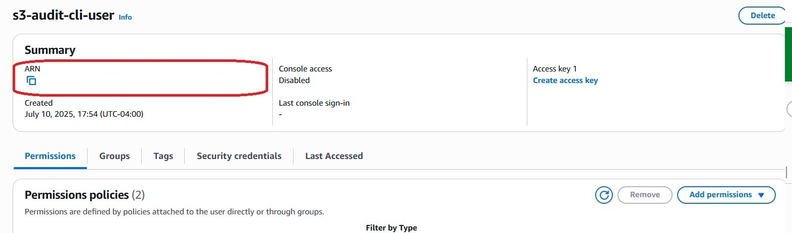

### **Secure AWS S3 Audit Access Granting – A Least Privilege Approach**

### **Introduction**

When performing a security audit of AWS S3 buckets, gaining access to a client's AWS environment is a critical step that must be handled with the utmost attention to security and the principle of least privilege. This document outlines a best-practice methodology for granting an external auditor (like our service) the necessary, yet strictly limited, read-only access to AWS S3 and IAM configurations.

This case study demonstrates how to ensure client data security and trust during the initial access phase of an S3 security audit.

### **Problem Statement**

Clients often need to provide access to their AWS accounts for third-party security assessments. A common challenge is balancing the need for the auditor to perform their work effectively with the imperative to prevent over-privileging, accidental modifications, or data exposure. Granting full administrative access is a significant security risk and should always be avoided.

### **Solution: Implementing Least-Privilege Read-Only Access via IAM User**

Our approach involves guiding the client through the creation of a dedicated IAM (Identity and Access Management) user with specific, read-only permissions limited to S3 and IAM services. This ensures the auditor can gather all necessary information without any capability to modify resources or access unrelated services.

**Key Security Principles Applied:**
* **Least Privilege:** Granting only the permissions absolutely necessary for the task.
* **Read-Only Access:** Ensuring no write, modify, or delete operations are possible.
* **Temporary Credentials:** Emphasizing the temporary nature of access and eventual revocation.
* **No Root User Access:** Never using or requesting root account credentials.
* **Programmatic Access Only:** Avoiding console access for the audit user unless specifically required and justified.

---

### **Implementation Steps (Client's Perspective Documented)**

The following steps mirror the process provided to the client, illustrating the ease and security of granting access.

**Step 1: Navigate to IAM in AWS Management Console**

The client first logs into their AWS Management Console with administrative privileges. They then navigate to the IAM service using the search bar.

**Step 2: Initiate New IAM User Creation**

From the IAM Dashboard, the client proceeds to the "Users" section and initiates the creation of a new IAM user.

**Step 3: Define User Details for Programmatic Access**

The user is named clearly (e.g., `s3-audit-cli-user`). Crucially, console access is explicitly disabled, as only programmatic access via Access Keys is required for CLI-based auditing. AWS prompts that Access Keys will be generated *after* user creation.

**Step 4: Assign Read-Only Permissions**

1.  On the **"Set permissions"** page:
    * Select the **"Attach policies directly"** option. This is the rightmost of the three options.

2.  In the search box below "Permissions policies," type **`SecurityAudit`**.
    * From the list of policies, find and **check the box** next to the **`SecurityAudit`** policy.
    * This single policy grants all necessary read-only permissions for auditing various AWS services, including S3 and IAM.

3.  Ensure **only the `SecurityAudit` policy is selected**.
4.  Click the **"Next"** button at the bottom of the page.

**Step 5: Review and Finalize User Creation**

The client reviews the configured user details and permissions summary to ensure accuracy and adherence to the least privilege model before finalizing the user creation.

**Step 6: Generate and Securely Retrieve Access Keys (Critical)**

After user creation, the client navigates to the user's "Security credentials" tab to generate the access keys. This involves acknowledging AWS's recommendations for more secure alternatives (like roles or Identity Center) but proceeding with Access Keys for CLI interaction.

The system then presents the **Access Key ID** and **Secret Access Key**.

**CRITICAL NOTE ON ACCESS KEY RETRIEVAL:**
The **Secret Access Key is displayed ONLY ONCE** at the time of creation. It cannot be retrieved later if lost. Clients are strongly advised to copy both keys immediately and store them securely. If the Secret Access Key is lost, a new access key must be generated, and the old one should be made inactive.

**Step 7: Secure Transmission of Credentials**

The client then securely transmits the generated Access Key ID and Secret Access Key to the auditor, ideally through the secure messaging system of the platform (e.g., Fiverr chat).

---

### **Benefits of This Approach**

* **Enhanced Security:** Limits the potential blast radius of a compromised credential to read-only S3 and IAM data.
* **Client Trust:** Demonstrates a commitment to security best practices, building confidence.
* **Audit Efficiency:** Provides precisely the access needed for a comprehensive S3 security assessment without unnecessary permissions.
* **Clear Documentation:** The step-by-step guide simplifies the process for clients, reducing friction.

### **Conclusion**

By following this least-privilege approach for granting AWS access during security audits, we ensure a secure, transparent, and efficient process. This methodology not only protects client assets but also reinforces our commitment as security professionals to the highest standards of cloud security.
