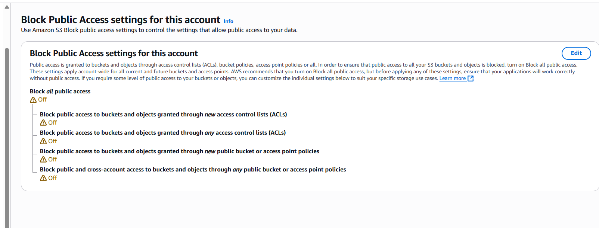
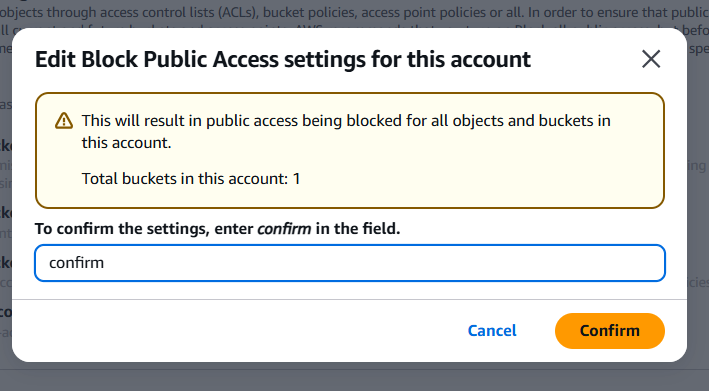
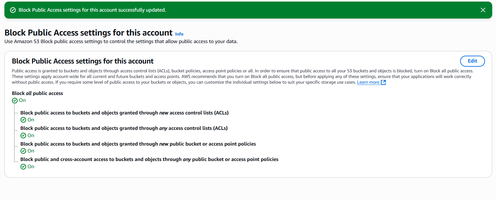

# AWS S3 Account-Level Block Public Access Configuration

This document outlines the steps taken to enable account-level public access blocking for Amazon S3 buckets, enhancing the overall security posture.

## 1. Initial Status: Public Access Off

Initially, the Block Public Access settings for the account were all disabled, indicating a potential vulnerability where S3 buckets could be publicly exposed if not explicitly secured at the bucket level.

  

## 2. Enabling Block Public Access for the Account

To enforce a robust security baseline, all four public access blocking options were enabled at the account level. This ensures that public access is blocked for all current and future S3 buckets within this AWS account, overriding any bucket-level settings that might attempt to grant public access.

The four critical settings enabled are:
* Block public access to buckets and objects granted through new access control lists (ACLs)
* Block public access to buckets and objects granted through any access control lists (ACLs)
* Block public access to buckets and objects granted through new public bucket policies
* Block public access to buckets and objects granted through any public bucket or access point policies

## 3. Confirmation of Settings

A confirmation step was performed to acknowledge the implications of these changes, which results in public access being blocked for all objects and buckets in this account.

  

## 4. Final Status: Public Access On

After saving the changes and confirming, the Block Public Access settings for the account were successfully updated, with all options now set to 'On'. This significantly increases the security posture by preventing unintended public exposure of S3 resources.

  
